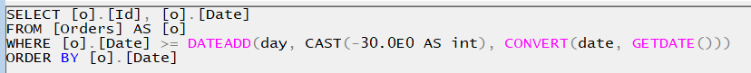
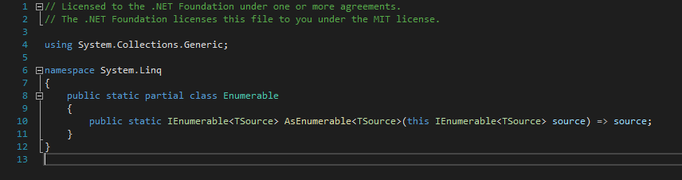
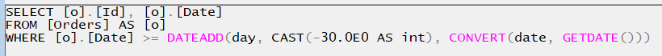

# Queryable vs Enumerable

## Problem Description

**Known: `DbSet` is `IQueriable`**

- We know that, in Entity Framework, the `DBSet` class implements `IQueriable` interface. So, all the Linq queries that we write are applied on an `IQueriable` object.

> The decompiled `DbSet`:
>
> ```csharp
> public abstract class DbSet<TEntity> : IQueryable<TEntity>, IAsyncEnumerable<TEntity>, IInfrastructure<IServiceProvider>, IListSource
>     where TEntity : class
> ```

**Step 1: Cast `IQueriable` to `IEnumerable`**

- But, what happens if we cast this `IQueriable` to `IEnumerable`. By the way, we can do that because it inherits `IEnumerable`.
  We also know that a cast does not change the instance in any other way in the memory. We interact with the same instance but using the specified interface to which we casted it to. So, it is the same old `IQueriable` object, but now, we see it as an `IEnumerable`.

> The decompiled `IQueryable`:
>
> ```csharp
> public interface IQueryable<[Nullable(2)] out T> : IEnumerable<T>, IEnumerable, IQueryable
> ```
>

**Step 2: Execute same Linq query**

- We will apply the same Linq query on the `IEnumerable` instead of `IQueryable`.

**Question**

- Does the execution change in any way?

## The Setup

### Database

I created a table in SQL Server containing orders. An order contains

- a GUID that uniquely identifies the order;
- the date when the order was created.


### Entity (Order)

From a C# project I used Entity Framework to access the database. First Of all I created the `Order` entity:

```csharp
internal class Order
{
    public Guid Id { get; set; }
    public DateTime Date { get; set; }
}
```

### DbContext (ShopDbContext)

Second, I created a `ShopDbContext` class:

```csharp
internal class ShopDbContext : DbContext
{
    public DbSet<Order> Orders { get; set; }
}
```

### Query (Linq)

In the `Main` method, I created a Linq query to retrieve all the orders from the last 30 days, ordered ascending by date.

```csharp
using ShopDbContext dbContext = new ShopDbContext();

List<Order> orders = dbContext.Orders
    .Where(x => x.Date >= DateTime.Today.AddDays(-30))
    .OrderBy(x => x.Date)
    .ToList();
```

## Test 1 - Initial query

I used SQL Server Profiler to check what SQL query is executed on the database for the above Linq query written in C#.

### Linq

The Linq query written in C#:

```csharp
List<Order> orders = dbContext.Orders
    .Where(x => x.Date >= DateTime.Today.AddDays(-30))
    .OrderBy(x => x.Date)
    .ToList();
```

### SQL

The SQL query executed in the database:



The SQL query contains both the `WHERE` and `ORDER BY` statements.

## Test 2 - Call `AsEnumerable` before `OrderBy`

Let's add a call to `AsEnumerable` before the `OrderBy` statement.

> **Note**
>
> It is worth to mention that the `AsEnumerable` method is making a simple cast to `IEnumerable`. In the decompiled code of the `AsEnumerable` method can be seen the implicit cast of the `source` instance that is returned as `IEnumerable<TSource>`:
>
> 

Before the call to `AsEnumerable`, we had an `IQueryable<Order>` object, after the call we have an `IEnumerable<Order>` object. The initial instance is not modified in any way in the memory. It is just seen further in the execution path as an `IEnumerable<Order>` instance. <u>Makes this any difference?</u>

### Linq

The Linq query written in C#:

```csharp
List<Order> orders = dbContext.Orders
    .Where(x => x.Date >= DateTime.Today.AddDays(-30))
    .AsEnumerable()
    .OrderBy(x => x.Date)
    .ToList();
```

### SQL

The SQL query executed in the database (from SQL Server Profiler):



The SQL query does not contain anymore the `ORDER BY` statement.

## Conclusion

All the Linq statements called on the `IQueryable` are translated into SQL queries and executed in the database.

All the Linq statements called on the `IEnumerable` are executed in C#, after the data is retrieved from the database.